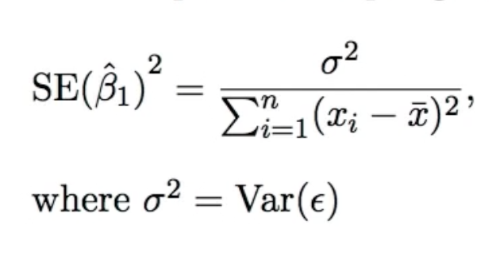

# Questions

## Does random noise help reduce bias error of a linear model? why?

Yes. If there is no random noise then estimating a non-linear relation with a linear model will not yield good results. On the contrary if there's significant noise, both a non linear and a linear ground truth may result in a similar sample.

## What factors affect how good is the estimated slope on a linear regression?

Standard error for the slope (B1):

Numerator: variance of the error around the line. More error = less precise slope.

Denominator: "Spread" of the Xs values around the mean. If all Xs are too close together, it's harder to estimate a precise slope.

## How do RSS, RSE and R2 relate?

RSS is the residual sum of squares, meaning the differences between `y` and `y_pred`, squared (to get rid of negatives).

RSE is mean RSS and then `sqrt`ed. This is useful to get a value that's not squared (e.g. dollars squared means nothing).

R2 is the coefficient of determination, meaning how much variance of `y` does `X` explain. Given by `TSS - RSS / TSS`, where `TSS` is the total sum of squares (the variance of the `y`s). Intuitively, if `RSS` is small R2 will be large, meaning that our model explains a lot of the variance in `y`.

## Difference between prediction interval and confidence interval

## With multiple regression coefficients "variance of all coefficients tends to increase, sometimes dramatically". Why?

## Pennies and # of coins in your pocket as estimation of how much change you have.

## On the multiple regression tv, newspaper and radio examples, is it always safe to assume that the least significant correlated variable is the one with least information?
